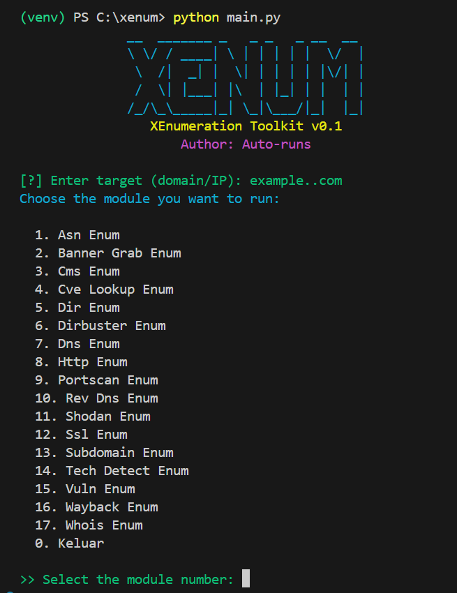

<p align="center">
  
</p>

<p align="center">
  <b>XENUM</b> is a modular enumeration toolkit with an interactive CLI interface.<br>
  Powered by <a href="https://github.com/Textualize/rich">rich</a> + <a href="https://pypi.org/project/pyfiglet/">pyfiglet</a>.
</p>

<p align="center">
  <a href="https://github.com/Auto-runs/XENUM/stargazers">
    
  </a>
  <a href="https://github.com/Auto-runs/XENUM/issues">
    
  </a>
  <a href="https://github.com/Auto-runs/XENUM/blob/main/LICENSE">
    
  </a>
  
</p>

---

## ✨ Features
- 📜 **Interactive menu** → choose modules directly from `main.py`
- 📊 **Output management**:
  - Results auto-saved in `results/` folder
  - JSON + TXT export
  - Pretty tables with [`tabulate`](https://pypi.org/project/tabulate/)
- 🎨 **Fancy UI**:
  - ASCII banner via `pyfiglet`
  - Spinner & fake progress bar with `rich`
- 🧩 **Modular design**:
  - Easily extendable, just drop new `.py` file into `core/`

---

## 📦 Available Modules (core/)
| Module                | Description |
|------------------------|-------------|
| `asn_enum.py`          | ASN enumeration & network info |
| `banner_grab_enum.py`  | Banner grabbing for service detection |
| `cms_enum.py`          | CMS detection (WordPress, Joomla, etc.) |
| `cve_lookup_enum.py`   | CVE vulnerability lookup |
| `dir_enum.py`          | Simple directory brute-forcing |
| `dirbuster_enum.py`    | Advanced directory enumeration |
| `dns_enum.py`          | DNS records enumeration (A, MX, TXT, etc.) |
| `http_enum.py`         | HTTP header & service checks |
| `portscan_enum.py`     | Basic port scanning |
| `rev_dns_enum.py`      | Reverse DNS lookup |
| `shodan_enum.py`       | Shodan API integration (requires API key) |
| `ssl_enum.py`          | SSL/TLS certificate enumeration |
| `subdomain_enum.py`    | Subdomain discovery |
| `tech_detect_enum.py`  | Web technology detection |
| `vuln_enum.py`         | Sensitive files detection (.env, phpinfo.php, etc.) |
| `wayback_enum.py`      | Wayback Machine historical URL fetch |
| `whois_enum.py`        | WHOIS lookup |

---

<p align="center">  </p>

---

## ⚙️ Installation
```bash
git clone https://github.com/Auto-runs/XENUM.git
cd XENUM

python -m venv venv
source venv/bin/activate   # Linux / Mac
venv\Scripts\activate      # Windows

pip install -r requirements.txt
